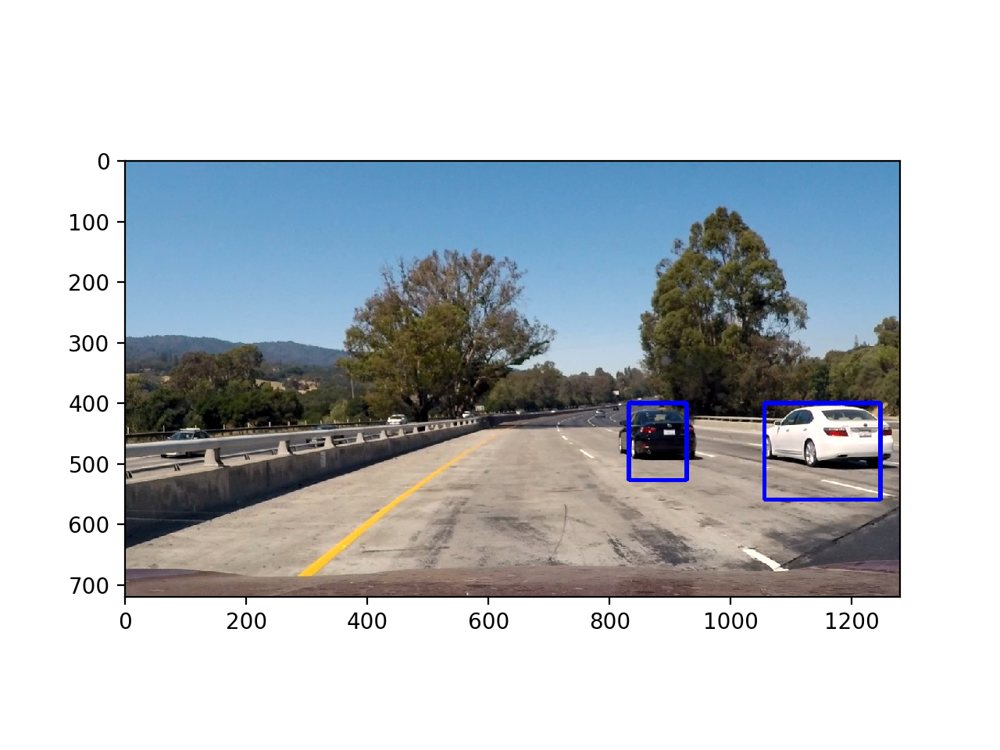
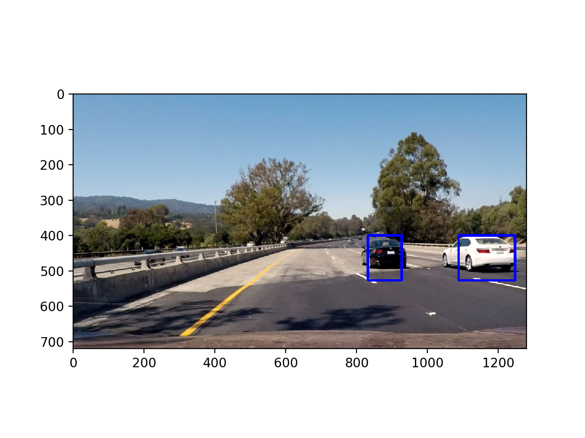
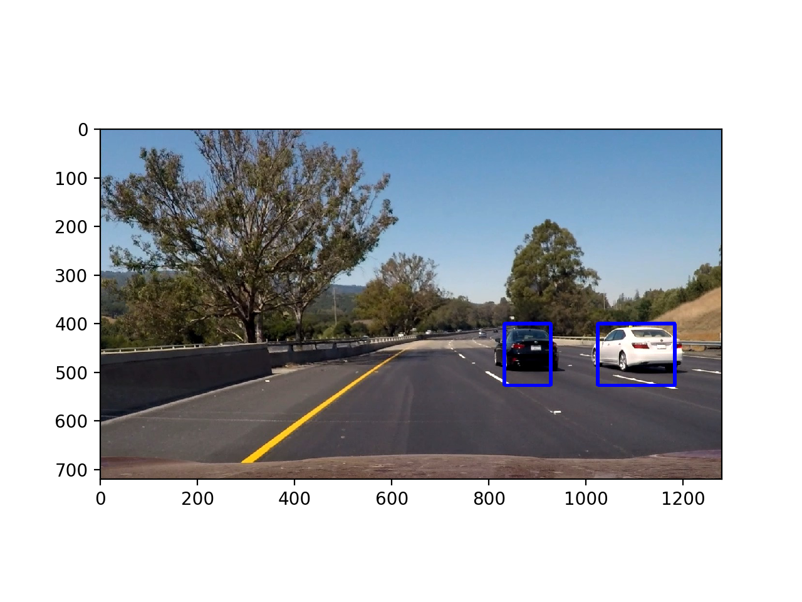

## Udacity Self-driving Car Vehicle Detection Project

---

**Vehicle Detection Project**

The goals / steps of this project are the following:

* Perform a Histogram of Oriented Gradients (HOG) feature extraction on a labeled training set of images and train a classifier Linear SVM classifier
* Optionally, you can also apply a color transform and append binned color features, as well as histograms of color, to your HOG feature vector. 
* Note: for those first two steps don't forget to normalize your features and randomize a selection for training and testing.
* Implement a sliding-window technique and use your trained classifier to search for vehicles in images.
* Run your pipeline on a video stream (start with the test_video.mp4 and later implement on full project_video.mp4) and create a heat map of recurring detections frame by frame to reject outliers and follow detected vehicles.
* Estimate a bounding box for vehicles detected.

[//]: # (Image References)
[image1]: ./examples/car_not_car.png
[image2]: ./examples/HOG_example.jpg
[image3]: ./examples/sliding_windows.jpg
[image4]: ./examples/sliding_window.jpg
[image5]: ./examples/bboxes_and_heat.png
[image6]: ./examples/labels_map.png
[image7]: ./examples/output_bboxes.png
[video1]: ./project_video.mp4

---
### README

### Histogram of Oriented Gradients (HOG)

#### 1. Explain how (and identify where in your code) you extracted HOG features from the training images.

The code for this step is contained in the first code cell in lines 14 through 47 of the file called `Vehicle-Detection-and-Tracking.py`.

I started by reading in all the `vehicle` and `non-vehicle` images.  Here is an example of one of each of the `vehicle` and `non-vehicle` classes:

Car Image Example          |  Non_car Image Example
:-------------------------:|:-------------------------:
|  

I then explored different color spaces and different `skimage.hog()` parameters (`orientations`, `pixels_per_cell`, and `cells_per_block`).  I grabbed random images from each of the two classes and displayed them to get a feel for what the `skimage.hog()` output looks like.

Here is an example using the `gray` color space and HOG parameters of `orientations=9`, `pixels_per_cell=8` and `cells_per_block=2`:

#### 2. Explain how you settled on your final choice of HOG parameters.

I tried various combinations of parameters and...

#### 3. Describe how (and identify where in your code) you trained a classifier using your selected HOG features (and color features if you used them).

I trained a linear SVM in my code using color classifer from line 130 through 209. Using spatial binning of: 32  and  32  histogram bins, and on a training-test split of 0.8-0.2, it achieved a test accuracy is 90.46%. 

### Sliding Window Search

#### 1. Describe how (and identify where in your code) you implemented a sliding window search.  How did you decide what scales to search and how much to overlap windows?

The Hog Sub-sampling Window Search function (find_cars function) was implemented in code line 61 through 131. 

The below was the first attempt to use the find_cars function with the classifier trained on 5,000 of car images and 5,000 non_car images. I used y start and stop positions as 400 and 656 respectively (most of lower half of the camera image where the majority of the images are roads and cars and not the skys and trees). I also uses a scale of 1.5.  The results appear to be reaonable good and there are multiple hits for a car. 

#### 3. Determing Classifier parameters. 

I determined the Classifier parameters by running combinations of different parameters values and compared the result using a table like the below. The below table shows the more relevant results. 

To test the performance of the classifier using different parameters value, I use a sample size of 1,000 car image and 1,000 non-car images. The prediction test sample is 100 images.

Shorthand used in the table are:
Config: configurations
Cspace: Colorspace
Ori: Orient
Pix/Cell: Pixels per Cell

| Config| Cspace | Ori | Pix/Cell | Cells/Block | HOG Channel|spatial|histbin| Accuracy |Prediction Time|Training Time|
| :----: | :-------: | :-: | :------: | :---------: | :--------: | -----:|:----:| :-------:|:----------:|:-----------:|
| 1      | RGB        | 9  | 8       | 2            | ALL        |(32,32)|32     | 96.75%   | 0.00501       |1.14
| 1      | RGB        | 10  | 8       | 2            | ALL        |(32,32)|32     |  98.5%     |0.004        |1.24|
| 1      | RGB        | 11  | 8       | 2            | ALL        |(32,32)|32     |97.25%      |0.005        |1.36
| 1      | RGB        | 9  | 16       | 2            | ALL        |(32,32)|32     | 98.75%      |0.00399        |1.48
| 1      | YCrCb        | 9  | 8       | 2            | ALL        |(32,32)|32     |         |        |
| 1      | RGB        | 9  | 8       | 2            | ALL        |(32,32)|32     |         |        |

#### 3. Multi-Windows Search - Determining optimal y ranges and scales

In different y ranges of the images, cars at different distances and positions relative to the camera tends to appear in different sizes/scales. Different y ranges and scales combinations are run manually on test images to determine the optimal combinations of y values and scale value for cars at particular distances and positions.

For images like the below, I found that the the optimal combinations are 500 to 400 of y pixel positions and scale of 1.5. The below image shows the y ranges search with such a scale.  

For images like the below, I found that the the optimal combinations are 400 to 480 of y pixel positions and scale of 1. The below image shows the y ranges search with such a scale.  

For performance reasons, I also use a few large scale windows search for the lowre half of the camera image with y values of 400 to 500 with a scale of 3. The below image shows the y ranges search with such a scale.  

I then combine these y values and scale values in the pipeline. I also move the y values by a certain number for each of the three value combination above to capture cars in somewhat different positions, while keeping the scale values the same. See code line 619 through to line 678 for the implementations. 

#### 3. Show some examples of test images to demonstrate how your pipeline is working.  What did you do to optimize the performance of your classifier?

The pipeline uses the find_cars function first and then use heat map to remove false positives. 

Ultimately I searched on two scales using YCrCb 3-channel HOG features plus spatially binned color and histograms of color in the feature vector, which provided a nice result.  Here are some example images:

---

### Video Implementation

#### 1. Provide a link to your final video output.  Your pipeline should perform reasonably well on the entire project video (somewhat wobbly or unstable bounding boxes are ok as long as you are identifying the vehicles most of the time with minimal false positives.)
Here's a [link to my video result](./project_video.mp4)

#### 2. Describe how (and identify where in your code) you implemented some kind of filter for false positives and some method for combining overlapping bounding boxes.

I recorded the positions of positive detections in each frame of the video.  From the positive detections I created a heatmap and then thresholded that map to identify vehicle positions.  I then used `scipy.ndimage.measurements.label()` to identify individual blobs in the heatmap.  I then assumed each blob corresponded to a vehicle.  I constructed bounding boxes to cover the area of each blob detected. See code line 715 to 729 for the implementations.   

Here's an example result showing the heatmap from a series of frames of video, the result of `scipy.ndimage.measurements.label()` and the bounding boxes then overlaid on the last frame of video:

### Here are six frames and their corresponding heatmaps:

![alt text][image5]

### Here is the output of `scipy.ndimage.measurements.label()` on the integrated heatmap from all six frames:
![alt text][image6]

### Here the resulting bounding boxes are drawn onto the last frame in the series:
![alt text][image7]

---

### Discussion

#### 1. Briefly discuss any problems / issues you faced in your implementation of this project.  Where will your pipeline likely fail?  What could you do to make it more robust?

Here I'll talk about the approach I took, what techniques I used, what worked and why, where the pipeline might fail and how I might improve it if I were going to pursue this project further.  

